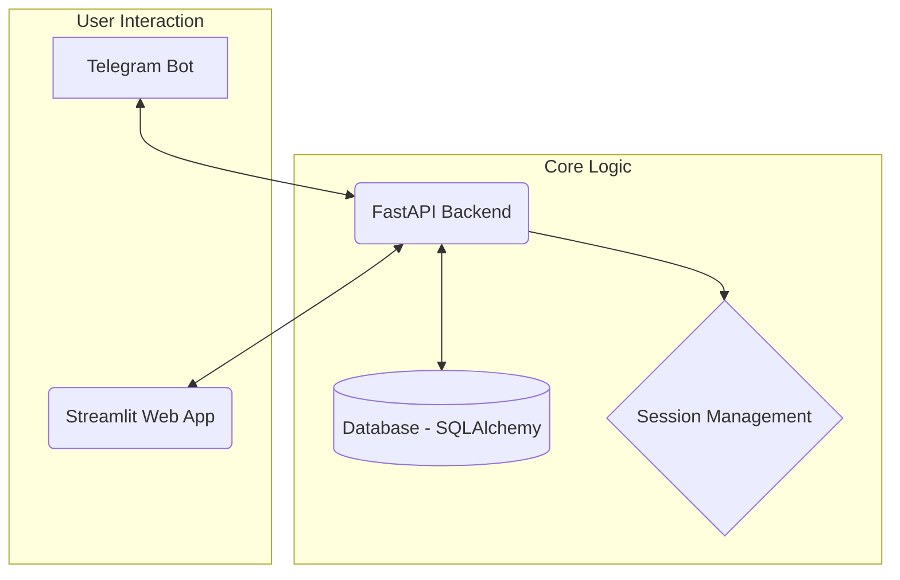

# 💬 Chat Crown

<p align="center">
  <strong>A comprehensive personal finance management system powered by Telegram and Streamlit.</strong>
</p>

<p align="center">
  Effortlessly track expenses, set financial goals, and gain deep insights into your financial health, all from the convenience of a Telegram bot and a powerful web dashboard.
</p>

---

## ✨ Key Features

### 🤖 Telegram Bot
Your personal finance assistant, always in your pocket.
- **Natural Language Input**: Log transactions by simply typing `lunch 25.50`.
- **Smart Categorization**: Transactions are automatically categorized.
- **Quick Summaries**: Get a monthly financial summary with the `/resumo` command.
- **Full Management**: List, edit, and delete transactions directly in chat.
- **Secure Login**: Generate a one-time code to securely access the web dashboard.

### 🖥️ Web Dashboard (Streamlit)
A powerful interface for deep dives into your data.
- **Interactive Visualizations**: See your income, expenses, and savings come to life.
- **Daily Budget Control**: Track daily spending against your limits (Breno Method).
- **Goal & Budget Tracking**: Set and monitor progress towards your financial goals and budgets.
- **Detailed Reports**: Analyze spending patterns with in-depth reports.
- **Transaction Management**: A full CRUD interface for your transaction history.

---

## 🏗️ Architecture

The system is built on a modular, monorepo structure with four core components that communicate via a central FastAPI backend.



### 🔐 Secure Authentication (Magic Link)

We use a secure, password-less authentication flow initiated in Telegram:
1.  **Request Code**: User types `/login` in the Telegram Bot.
2.  **Receive Code**: The bot generates and sends a unique 6-digit code.
3.  **Login**: The user enters the code on the Streamlit web app to gain access.

The primary identifier is the unique `telegram_id`, ensuring security and convenience.

---

## 🛠️ Tech Stack

- **Backend**: Python 3.10+, FastAPI, Uvicorn
- **Frontend**: Streamlit
- **Bot**: `python-telegram-bot`
- **Database**: SQLAlchemy ORM (PostgreSQL, SQLite)
- **Package Management**: `uv`

---

## 🚀 Getting Started

Follow these steps to get a copy of the project up and running on your local machine.

### Prerequisites

- Python 3.10 or higher
- [`uv`](https://github.com/astral-sh/uv) for fast dependency management.

### Installation

1.  **Clone the repository**
    ```bash
    git clone https://github.com/your-username/chat-crown.git
    cd chat-crown
    ```

2.  **Install dependencies**
    ```bash
    uv sync
    ```

3.  **Configure environment variables**
    Create a `.env` file in the root directory and add the necessary tokens and configurations (see `config/config.py` for details).
    ```env
    TELEGRAM_BOT_TOKEN="your_bot_token_here"
    DATABASE_URL="sqlite:///./finance.db" # or your PostgreSQL URL
    ```

4.  **Run the application**
    The `start.py` script will launch both the FastAPI backend and the Streamlit app.
    ```bash
    uv run start.py
    ```

Now, you can interact with your bot on Telegram and access the web dashboard at the URL provided in the terminal (usually `http://localhost:8501`).

---

## 📁 Project Structure

```
chat-crown/
├── api/             # FastAPI Backend: Endpoints and logic
├── bot/             # Telegram Bot: Handlers and commands
├── streamlit_app/   # Streamlit Web App: Pages and UI
├── services/        # Business Logic Layer
├── models/          # SQLAlchemy Database Models
└── config/          # Configuration management
```

---

## 🗺️ Roadmap

- [ ] **Real-time Webhooks**: For instant bot responses and notifications.
- [ ] **Advanced AI Insights**: Predictive spending analysis and personalized advice.
- [ ] **Investment Tracking**: Monitor stocks, crypto, and other investments.
- [ ] **Mobile Application**: A native app for an enhanced on-the-go experience.
- [ ] **Multi-currency Support**: Manage finances in different currencies.
- [ ] **Export & Integrations**: Data export (OFX) and integration with external tools.

---

<div align="center">
  Made with ❤️ by the Chat Crown Team
</div>